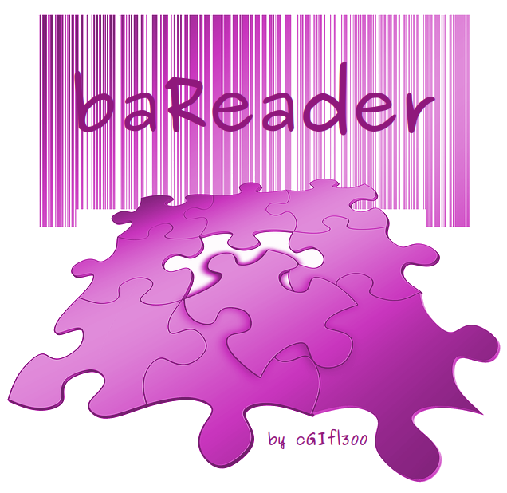

.. baReader documentation master file, created by
   sphinx-quickstart on Thu Mar 12 18:29:57 2020.
   You can adapt this file completely to your liking, but it should at least
   contain the root `toctree` directive.
   
======================
baReader Documentation
======================
|logo|

Use your webcam to copy the content of a bar code into your clipboard.
For a better use this version may include the use of tesseract (for OCR).
You should first considere installing this opensource software if you need OCR.

To enable OCR just use main-with-tesseract.py instead of main.py.

.. toctree::
   :maxdepth: 2
   :caption: Contents:
   
   

Index
=====

* `Project Website`__
* `Source Code`__

.. _projet: https://bareader.rtfd.org/
__ projet_

.. _source: https://github.com/cgifl300/bareader/
__ source_
   

